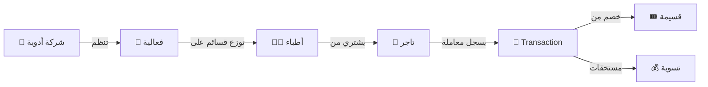
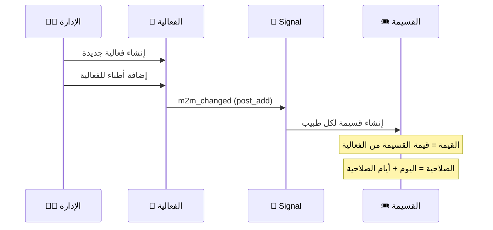
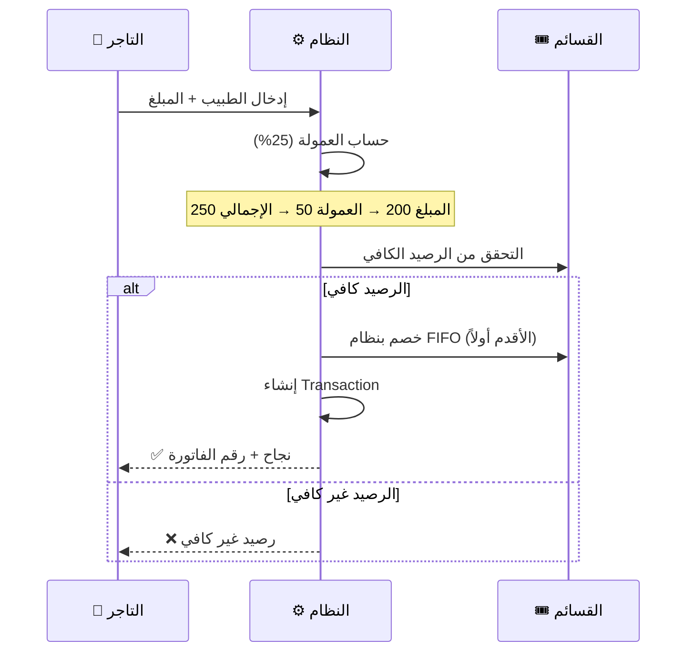

# 🏛️ شرح مفصل لنظام إدارة قسائم مطعم قرية حضرموت

## نظرة عامة

نظام إدارة القسائم (Voucher Management System) مبني بـ **Django 5.2** ويدير دورة كاملة تبدأ من تنظيم شركات الأدوية لفعاليات → توزيع قسائم على الأطباء → استخدام الأطباء للقسائم عند التجار → تسوية حسابات التجار.

---

## 1️⃣ التطبيقات (Apps) وهيكل المشروع

| التطبيق | الملفات الرئيسية | الوظيفة |
|---|---|---|
| **`accounts`** | [models.py](file:///c:/Users/HP/Desktop/theme/handramot_events/accounts/models.py) | إدارة المستخدمين (Admin/Doctor/Vendor) |
| **`events`** | [models.py](file:///c:/Users/HP/Desktop/theme/handramot_events/events/models.py), [signals.py](file:///c:/Users/HP/Desktop/theme/handramot_events/events/signals.py) | إدارة الفعاليات والقسائم |
| **`core`** | [models.py](file:///c:/Users/HP/Desktop/theme/handramot_events/core/models.py), [services.py](file:///c:/Users/HP/Desktop/theme/handramot_events/core/services.py), [views.py](file:///c:/Users/HP/Desktop/theme/handramot_events/core/views.py) | المعاملات، التسويات، و Business Logic |
| **`project`** | [settings.py](file:///c:/Users/HP/Desktop/theme/handramot_events/project/settings.py), [urls.py](file:///c:/Users/HP/Desktop/theme/handramot_events/project/urls.py) | إعدادات المشروع والروابط |

---

## 2️⃣ نماذج البيانات (Models) - شرح تفصيلي

### `accounts` App

#### 👤 User - المستخدم
- يرث من `AbstractUser` (Django built-in)
- حقل `type` يحدد نوع المستخدم: **ADMIN** / **DOCTOR** / **VENDOR**
- كل مستخدم له نوع واحد فقط

#### 👨‍⚕️ Doctor - الطبيب
- مربوط بـ [User](file:///c:/Users/HP/Desktop/theme/handramot_events/accounts/models.py#5-17) عبر `OneToOneField`
- حقول: **الاسم، الهاتف (فريد)، البريد (فريد)، التخصص، QR Code**
- الـ QR Code عبارة عن رابط لصفحة ملف الطبيب

#### 🏪 Vendor - التاجر
- مربوط بـ [User](file:///c:/Users/HP/Desktop/theme/handramot_events/accounts/models.py#5-17) عبر `OneToOneField`
- حقول: **الاسم (فريد)، جهة الاتصال، الهاتف، البريد، العنوان، التصنيف**
- التصنيف مثل: سوبرماركت، مطعم، إلخ

### `events` App

#### 🎉 Event - الفعالية
- حقول: **الاسم، التاريخ، الشركة المنظمة (FK)، قيمة القسيمة، مدة صلاحية القسيمة**
- مربوط بـ [PharmaceuticalCompany](file:///c:/Users/HP/Desktop/theme/handramot_events/core/models.py#4-19) عبر `ForeignKey`
- مربوط بالأطباء عبر `ManyToManyField` (يمكن إضافة أطباء متعددين)
- **Signal**: عند إضافة أطباء للفعالية، يتم إنشاء قسائم تلقائياً لكل طبيب

#### 🎟️ Voucher - القسيمة
- حقول: **الطبيب، الفعالية، القيمة الأولية، الرصيد الحالي، تاريخ الإصدار، تاريخ الانتهاء، نشطة/غير نشطة**
- `current_balance` يتناقص مع كل عملية شراء
- `is_active` يصبح `False` عند استنفاد الرصيد أو انتهاء الصلاحية
- تاريخ الانتهاء يُحسب تلقائياً: `اليوم + عدد أيام الصلاحية من الفعالية`

### `core` App

#### 🏢 PharmaceuticalCompany - شركة الأدوية
- حقول: **الاسم (فريد)، جهة الاتصال، الهاتف، البريد، العنوان**

#### 📄 Transaction - المعاملة
- **أهم جدول في النظام** - يسجل كل عملية شراء
- حقول: **القسيمة، التاجر، الطبيب، المبلغ المنفق، نسبة العمولة (25%)، مبلغ العمولة، إجمالي المخصوم، تاريخ المعاملة، وصف المشتريات، رقم الفاتورة (فريد)**
- مربوط بـ [VendorSettlement](file:///c:/Users/HP/Desktop/theme/handramot_events/core/models.py#20-32) عبر FK (اختياري - لتتبع التسوية)

#### 💰 VendorSettlement - تسوية التاجر
- حقول: **التاجر، المبلغ المسدد، تاريخ التسوية**
- يربط المعاملات التي تم تسويتها

---

## 3️⃣ العمليات الأساسية (Business Logic)

### ⚙️ عملية 1: إنشاء فعالية وتوزيع القسائم

**الكود المسؤول**: [signals.py](file:///c:/Users/HP/Desktop/theme/handramot_events/events/signals.py)
- يستخدم `m2m_changed` signal على `Event.doctors.through`
- عند إضافة أطباء (`action == "post_add"`)، يتم إنشاء [Voucher](file:///c:/Users/HP/Desktop/theme/handramot_events/events/models.py#23-51) لكل طبيب
- يتحقق من عدم وجود قسيمة مكررة (نفس الفعالية + نفس الطبيب)

### ⚙️ عملية 2: معالجة المعاملات (Transaction Processing)

هذه **أهم عملية** في النظام. عندما يشتري طبيب من تاجر:

**الكود المسؤول**: [services.py](file:///c:/Users/HP/Desktop/theme/handramot_events/core/services.py) - دالة [process_transaction](file:///c:/Users/HP/Desktop/theme/handramot_events/core/services.py#8-95)

**آلية الخصم FIFO**:
1. جلب جميع القسائم النشطة للطبيب مرتبة حسب تاريخ الانتهاء (الأقرب أولاً)
2. حساب العمولة: `management_fee = amount × 25%`
3. حساب الإجمالي: `total = amount + management_fee`
4. التحقق من أن إجمالي الرصيد المتاح ≥ الإجمالي المطلوب
5. الخصم التسلسلي:
   - إذا رصيد القسيمة ≥ المتبقي → خصم المتبقي كله منها
   - إذا رصيد القسيمة < المتبقي → تفريغ القسيمة + إلغاء تنشيطها + الانتقال للتالية
6. إنشاء [Transaction](file:///c:/Users/HP/Desktop/theme/handramot_events/core/models.py#33-61) مربوط بالقسيمة الأولى المستخدمة
7. كل العملية داخل `transaction.atomic()` لضمان الاتساق

### ⚙️ عملية 3: تسوية حسابات التجار

- الإدارة تستعرض المبالغ المستحقة لكل تاجر
- المبلغ المستحق = مجموع `amount_spent` من المعاملات غير المسواة
- عند التسوية: إنشاء [VendorSettlement](file:///c:/Users/HP/Desktop/theme/handramot_events/core/models.py#20-32) وربطه بالمعاملات

### ⚙️ عملية 4: البحث عن طبيب (Doctor Lookup)

**الكود**: [views.py](file:///c:/Users/HP/Desktop/theme/handramot_events/core/views.py) - كلاس [DoctorLookupView](file:///c:/Users/HP/Desktop/theme/handramot_events/core/views.py#54-69)
- API يرجع JSON
- البحث بالاسم أو رقم الهاتف
- يرجع: ID، الاسم، الهاتف، والرصيد المتاح (مجموع القسائم النشطة)
- يستخدمه التاجر في صفحة تسجيل المعاملة

### ⚙️ عملية 5: لوحة التحكم (Dashboard API)

**الكود**: [api_views.py](file:///c:/Users/HP/Desktop/theme/handramot_events/core/api_views.py) - دالة [dashboard_stats_api](file:///c:/Users/HP/Desktop/theme/handramot_events/core/api_views.py#10-73)

يرجع:
- **KPIs**: إجمالي الإيرادات، إيرادات آخر 7 أيام، نسبة النمو، عدد المعاملات، عدد الأطباء، عدد التجار، القسائم النشطة
- **Chart Data**: إيرادات آخر 30 يوم (يومياً)
- **Top Vendors**: أعلى 5 تجار حسب الإيرادات

---

## 4️⃣ واجهة الإدارة (Admin Panel)

النظام يستخدم **django-unfold** كثيم للأدمن مع:
- ألوان Maroon مستوحاة من هوية المطعم
- Sidebar منظم بأقسام: Dashboard, Accounts, Events Management, Transactions & Finance
- Dashboard مخصص بـ KPI cards ورسوم بيانية Chart.js
- دعم اللغة العربية (`LANGUAGE_CODE = 'ar'`)

---

## 5️⃣ قائمة URLs للصفحات (لأخذ Screenshots)

### 📸 صفحات الأدمن (تحتاج تسجيل دخول كـ Admin/Superuser)

| # | الصفحة | URL | الوصف |
|---|---|---|---|
| 1 | 🏠 لوحة التحكم الرئيسية | `/admin/` | Dashboard بـ KPIs + رسوم بيانية + أعلى التجار |
| 2 | 👤 قائمة المستخدمين | `/admin/accounts/user/` | جدول كل المستخدمين مع الفلترة |
| 3 | 👨‍⚕️ قائمة الأطباء | `/admin/accounts/doctor/` | جدول الأطباء + بحث |
| 4 | ➕ إضافة طبيب | `/admin/accounts/doctor/add/` | نموذج إضافة طبيب جديد |
| 5 | 🏪 قائمة التجار | `/admin/accounts/vendor/` | جدول التجار + فلترة حسب التصنيف |
| 6 | ➕ إضافة تاجر | `/admin/accounts/vendor/add/` | نموذج إضافة تاجر جديد |
| 7 | 🎉 قائمة الفعاليات | `/admin/events/event/` | جدول الفعاليات + فلترة |
| 8 | ➕ إنشاء فعالية | `/admin/events/event/add/` | نموذج إنشاء فعالية مع اختيار أطباء |
| 9 | 🎟️ قائمة القسائم | `/admin/events/voucher/` | جدول القسائم مع الحالة والرصيد |
| 10 | 📄 قائمة المعاملات | `/admin/core/transaction/` | جدول المعاملات مع التفاصيل |
| 11 | 💰 قائمة التسويات | `/admin/core/vendorsettlement/` | جدول تسويات التجار |
| 12 | 🏢 شركات الأدوية | `/admin/core/pharmaceuticalcompany/` | جدول شركات الأدوية |

### 📸 صفحات التاجر (تحتاج تسجيل دخول كتاجر)

| # | الصفحة | URL | الوصف |
|---|---|---|---|
| 13 | 🔐 تسجيل الدخول | `/accounts/login/` | صفحة تسجيل الدخول |
| 14 | 📊 لوحة تحكم التاجر | `/vendor/dashboard/` | إحصائيات التاجر + آخر المعاملات |
| 15 | ➕ تسجيل معاملة جديدة | `/vendor/transaction/new/` | بحث عن طبيب + إدخال المبلغ |

### 📸 صفحات عامة

| # | الصفحة | URL | الوصف |
|---|---|---|---|
| 16 | 👨‍⚕️ ملف الطبيب | `/doctor/{id}/` | القسائم + سجل المعاملات (عبر QR Code) |

### 📸 API Endpoints (للتوثيق)

| # | الوصف | URL |
|---|---|---|
| 17 | إحصائيات لوحة التحكم | `/api/dashboard-stats/` |
| 18 | البحث عن طبيب | `/api/doctor-lookup/?q=اسم` |

> [!TIP]
> لأخذ أفضل screenshots، قم بتشغيل الـ Seeder أولاً لملء قاعدة البيانات بداتا واقعية، ثم التقط الصور من الصفحات أعلاه.

---

## 6️⃣ التقنيات المستخدمة

| التقنية | الاستخدام |
|---|---|
| **Django 5.2** | Backend Framework |
| **SQLite** | قاعدة البيانات (يمكن التحويل لـ PostgreSQL) |
| **django-unfold** | ثيم لوحة التحكم الإدارية |
| **Chart.js** | رسوم بيانية في الداشبورد |
| **Cairo Font** | خط عربي عصري |
| **Vanilla JS** | تفاعلات الواجهة (AJAX, Search) |

